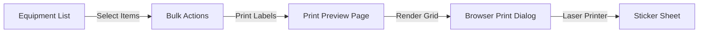

# System Analysis: QR Code Implementation Flow

## 1. Executive Summary
Current QR code implementation provides excellent foundational capabilities (generation per item, scanning, API endpoints) but lacks critical **Efficiency Features** for mass-deployment (Batch Processing). The current flow is "Item-Centric" rather than "Operation-Centric", creating significant friction during the initial setup phase.

---

## 2. Current Flow Analysis

### Phase A: Creation & Labeling (The Bottle Neck)
Current workflow for labeling 100 new items:
1.  Open Equipment List.
2.  Click "Detail" on Item A.
3.  Click "QR Tab".
4.  Click "Generate" (if new).
5.  Click "Print".
6.  **Browser opens print dialog for 1 full A4 page.**
7.  Admin prints, cuts the paper, tapes it to device.
8.  *Repeat steps 2-7 for 99 other items.*

**Critique:**
- **Time efficiency**: Extremely poor. Estimated 3-5 mins per item.
- **Material waste**: Printing 1 QR per A4 page is wasteful.
- **Physical durability**: Plain paper + tape is not durable for lab equipment (chemicals, friction).

### Phase B: Usage (Scanning)
1.  User opens "Scan QR" menu on mobile.
2.  Camera scans code.
3.  System routes to `/dashboard/equipment/[id]`.
4.  User sees details.

**Critique:**
- **Functional**: Works well for "Identification".
- **Gap**: Lacks "Contextual Action". If I scan an item, I likely want to *do* something with it (Borrow, Report Broken, Audit), not just stare at its specs.

---

## 3. Gap Analysis

| Feature | Current State | Required State | Impact |
|---------|---------------|----------------|--------|
| **Bulk Generation** | Backend Only (API/Service) | Frontend UI Selection | High (Setup Time) |
| **Print Layout** | Single Page (A4) | Grid Layout (Sticker Sheet) | High (Material Cost) |
| **Material/Media** | Paper | Vinyl/Plastic Sticker | Medium (Durability) |
| **Scan Action** | View Detail | View + Quick Action | Medium (UX) |

---

## 4. Recommendations & Roadmap

### A. Immediate Fix: Bulk Printing UI (Priority 1)
To solve the labeling bottleneck:
1.  **Add Selection**: Checkboxes in `EquipmentList`.
2.  **Bulk Action Bar**: "Selected (5): [Print QR Labels]".
3.  **Dedicated Print View**: A new page rendering selected QRs in a CSS Grid.
    - **Layout**: 3 columns x 8 rows (Standard A4 Sticker Sheet).
    - **Content**: QR + Asset Name + ID (Minimal text).
    - **CSS**: `@media print` query to hide UI buttons.

### B. Hardware/Material Recommendation
- **Stickers**: Use "A4 Die-Cut Labels" (e.g., Tom & Jerry no. 103 or Avery equivalents) standardizing size (e.g., 50x50mm).
- **Printers**: Standard Laser Printer (more durable than Inkjet).

### C. Enhanced Scan Workflows
Upgrade the scan result page based on User Role:
- **Student**: Scan -> "Ajukan Peminjaman" (Quick Borrow).
- **Admin**: Scan -> options for "Audit Check (Opname)", "Update Condition", "Check-in/Return".

---

## 5. Technical Implementation Plan (Bulk Print)

**Proposed File Structure:**
- `app/dashboard/equipment/print-labels/page.tsx` (The grid view)
- `components/equipment/equipment-list.tsx` (Add selection logic)
